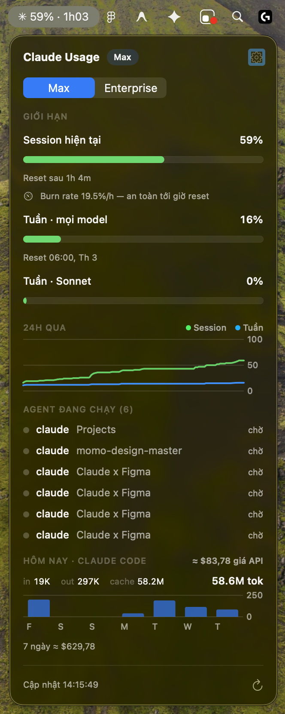
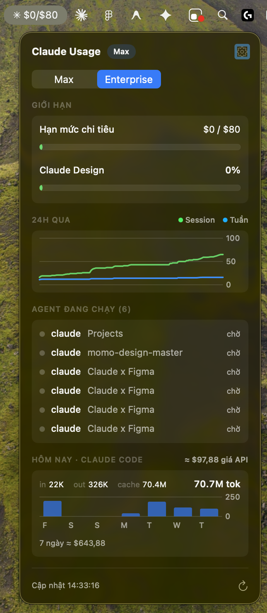
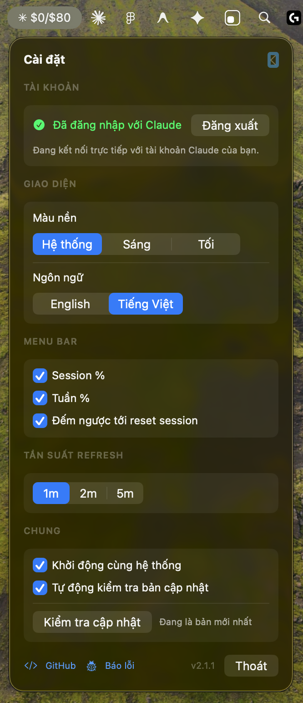

# ClaudePulse ✳

macOS menu bar app theo dõi liên tục usage limits của Claude — hỗ trợ gói cá nhân (Pro/Max) lẫn **Enterprise**, không cần mở `/usage` trong Claude Code nữa.

<p align="center">
  
  
  
</p>

**Menu bar:** gói cá nhân hiện `✳ 59% · 16% · 1h03` (session 5h · weekly · countdown tới reset), gói Enterprise hiện `✳ $0/$80` (hạn mức chi tiêu) — thêm `❗` khi sắp chạm limit.

## Tính năng

- **Limits**: progress bar từng hạng mục — gói cá nhân: Current session, Weekly · All models, Weekly · Sonnet/Opus; gói Enterprise: Hạn mức chi tiêu ($ đã dùng / hạn mức), Claude Design allowance — đổi màu theo mức dùng, kèm giờ reset
- **Nhiều tài khoản**: có cả token Claude Code lẫn Sign in with Claude (vd cá nhân + Enterprise) → tab chuyển tài khoản đầu popover, xem được cả 2
- **Burn rate + dự báo**: tốc độ tiêu %/giờ và dự đoán có chạm 100% trước giờ reset không
- **Last 24h**: biểu đồ lịch sử session + weekly
- **Agents running**: các AI coding agent đang chạy trên máy (Claude Code, Codex, Gemini CLI, Aider) kèm thư mục dự án và trạng thái working/idle
- **Today · Claude Code**: token dùng trong ngày (in/out/cache) kèm **breakdown theo từng model** (tự nhận diện model mới), quy đổi ≈ giá API (tham khảo), biểu đồ chi phí 7 ngày
- **Service status**: tự cảnh báo trong popover khi Anthropic đang có sự cố (bình thường ẩn)
- **Thu gọn/mở rộng** từng section, app nhớ lựa chọn; header thu gọn hiện tóm tắt nhanh
- **Notifications**: cảnh báo khi vượt 80% / 95%, báo khi session limit reset xong, báo khi có phiên bản mới
- **Tự động cập nhật**: app tự kiểm tra bản mới trên GitHub, bấm Update là tự tải + tự thay + tự mở lại
- **Giao diện**: theme Sáng / Tối / theo Hệ thống; ngôn ngữ English / Tiếng Việt (thuật ngữ chuẩn như session, token, burn rate giữ nguyên tiếng Anh)
- **Settings (⚙)**: tài khoản, giao diện, tuỳ chọn hiển thị menu bar, refresh interval 1m/2m/5m, khởi động cùng hệ thống

## Cài đặt

1. Tải `ClaudePulse.dmg` từ [Releases](../../releases), mở và kéo **ClaudePulse** vào **Applications**.
2. Vì app chưa notarize (không có Apple Developer ID), lần đầu mở macOS sẽ chặn:
   - Mở **System Settings → Privacy & Security**, kéo xuống và bấm **Open Anyway**.
   - Hoặc chạy: `xattr -d com.apple.quarantine /Applications/ClaudePulse.app`
3. Khi app xin quyền Notifications → **Allow** (để nhận cảnh báo ngưỡng và thông báo bản mới). Không có hộp thoại Keychain nào.

Từ đó về sau **không cần cài tay nữa** — có bản mới app sẽ báo, bấm Update là xong.

**Yêu cầu:** macOS 14+, và một trong hai: đã đăng nhập [Claude Code](https://claude.com/claude-code) trên máy, **hoặc** dùng **Sign in with Claude** ngay trong app (Settings ⚙ → Account).

## Cách hoạt động & bảo mật

Hai cách kết nối tài khoản:

1. **Mặc định**: app đọc OAuth token của Claude Code từ macOS Keychain (item `Claude Code-credentials`, đọc qua công cụ `security` của Apple nên không có hộp thoại xin quyền) — **chỉ đọc**, không sửa, không tự refresh, không gửi đi đâu ngoài `api.anthropic.com`. Phù hợp người dùng Claude Code hằng ngày (Claude Code tự gia hạn token).
2. **Sign in with Claude** (Settings ⚙ → Account): kết nối ClaudePulse trực tiếp với tài khoản Claude qua OAuth chính thức của Anthropic — app giữ token **riêng** (file `~/Library/Application Support/ClaudePulse/credentials.json`, quyền 0600 chỉ user đọc được) và tự quản lý, độc lập hoàn toàn với Claude Code. Phù hợp người chủ yếu dùng Claude app/web, hoặc muốn theo dõi tài khoản thứ hai (vd Enterprise). Không có hộp thoại xin quyền nào cho phần này.

Chi tiết:

- Gọi `GET https://api.anthropic.com/api/oauth/usage` theo chu kỳ — cùng endpoint mà lệnh `/usage` của Claude Code dùng. Hỗ trợ cả limit dạng % (Pro/Max) lẫn dạng hạn mức chi tiêu (Enterprise).
- Thống kê token đọc từ transcript local của Claude Code (`~/.claude/projects/**/*.jsonl`) — chỉ đọc. Con số $ là quy đổi theo giá niêm yết API để tham khảo, không phải tiền bị trừ.
- Danh sách agent lấy từ process list của chính user (libproc) — không cần quyền đặc biệt.
- Kiểm tra bản mới qua GitHub Releases API (ẩn danh, tắt được trong Settings); bản cập nhật tải trực tiếp từ Releases của repo này.
- Lịch sử usage lưu local tại `~/Library/Application Support/ClaudePulse/history.json` (48h). Log tại `~/Library/Logs/ClaudePulse.log`.
- Không thu thập, không gửi telemetry. Toàn bộ source code trong repo này.

## Build từ source

```bash
git clone https://github.com/MXVUX/ClaudePulse.git && cd ClaudePulse
./scripts/build_dmg.sh 2.0.0   # → dist/ClaudePulse.dmg (universal: Apple Silicon + Intel)
```

Yêu cầu Xcode 16+ / Swift 6. Script tự ký bằng identity `ClaudeBar Signing` nếu có trong Keychain, không thì ký ad-hoc.

## Cấu trúc source

- `Sources/ClaudeBar/ClaudeBarApp.swift` — entry point, MenuBarExtra, chặn chạy trùng, onboarding lần đầu
- `Sources/ClaudeBar/UsageModel.swift` — fetch usage, đa tài khoản, burn rate, dự báo, cảnh báo ngưỡng
- `Sources/ClaudeBar/ClaudeAuth.swift` — Sign in with Claude (OAuth PKCE), lưu + tự gia hạn token riêng
- `Sources/ClaudeBar/KeychainTokenProvider.swift` — đọc token Claude Code từ Keychain
- `Sources/ClaudeBar/UpdateChecker.swift` — kiểm tra bản mới + tự cập nhật
- `Sources/ClaudeBar/AgentMonitor.swift` — quét agent đang chạy (libproc)
- `Sources/ClaudeBar/StatusChecker.swift` — theo dõi status page của Anthropic
- `Sources/ClaudeBar/TokenStats.swift` — thống kê token/chi phí từ transcript
- `Sources/ClaudeBar/HistoryStore.swift` — lưu lịch sử usage cho sparkline
- `Sources/ClaudeBar/L10n.swift` — song ngữ EN/VI
- `Sources/ClaudeBar/Theme.swift` — theme sáng/tối/hệ thống
- `Sources/ClaudeBar/Notifier.swift` — macOS notifications
- `Sources/ClaudeBar/PopoverView.swift` — UI popover + Settings (SwiftUI + Charts)
- `scripts/build_dmg.sh` — build universal binary → .app → codesign → .dmg

## License

MIT
